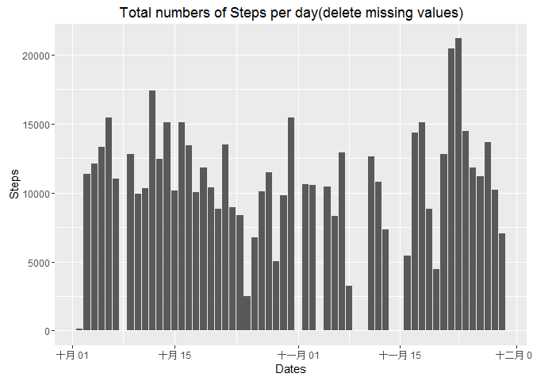

# Peer-graded Assignment：Course Project 1
Chia Yu,Tsai  
2016年10月22日  

```r
library(ggplot2)
```
#Loading and preprocessing the data

##1.Load the data (i.e. read.csv())

```r
setwd("F:/coursera/repdata_2Fdata")
activity=read.csv("activity.csv",stringsAsFactors = F)
```
##2.Process/transform the data (if necessary) into a format suitable for your analysis

```r
str(activity)
```

```
## 'data.frame':	17568 obs. of  3 variables:
##  $ steps   : int  NA NA NA NA NA NA NA NA NA NA ...
##  $ date    : chr  "2012-10-01" "2012-10-01" "2012-10-01" "2012-10-01" ...
##  $ interval: int  0 5 10 15 20 25 30 35 40 45 ...
```

```r
head(activity)
```

```
##   steps       date interval
## 1    NA 2012-10-01        0
## 2    NA 2012-10-01        5
## 3    NA 2012-10-01       10
## 4    NA 2012-10-01       15
## 5    NA 2012-10-01       20
## 6    NA 2012-10-01       25
```

```r
summary(activity)
```

```
##      steps            date              interval     
##  Min.   :  0.00   Length:17568       Min.   :   0.0  
##  1st Qu.:  0.00   Class :character   1st Qu.: 588.8  
##  Median :  0.00   Mode  :character   Median :1177.5  
##  Mean   : 37.38                      Mean   :1177.5  
##  3rd Qu.: 12.00                      3rd Qu.:1766.2  
##  Max.   :806.00                      Max.   :2355.0  
##  NA's   :2304
```
We have to let the date variable readable to the computer.

```r
activity$date=as.Date(activity$date,"%Y-%m-%d")
```
#What is mean total number of steps taken per day?

##1.Calculate the total number of steps taken per day

```r
TotalSteps=aggregate(activity$steps, by=list(activity$date), FUN=sum)
dimnames(TotalSteps)[[2]]=c("date","Steps")
(TotalSteps=TotalSteps[complete.cases(TotalSteps),])
```

```
##          date Steps
## 2  2012-10-02   126
## 3  2012-10-03 11352
## 4  2012-10-04 12116
## 5  2012-10-05 13294
## 6  2012-10-06 15420
## 7  2012-10-07 11015
## 9  2012-10-09 12811
## 10 2012-10-10  9900
## 11 2012-10-11 10304
## 12 2012-10-12 17382
## 13 2012-10-13 12426
## 14 2012-10-14 15098
## 15 2012-10-15 10139
## 16 2012-10-16 15084
## 17 2012-10-17 13452
## 18 2012-10-18 10056
## 19 2012-10-19 11829
## 20 2012-10-20 10395
## 21 2012-10-21  8821
## 22 2012-10-22 13460
## 23 2012-10-23  8918
## 24 2012-10-24  8355
## 25 2012-10-25  2492
## 26 2012-10-26  6778
## 27 2012-10-27 10119
## 28 2012-10-28 11458
## 29 2012-10-29  5018
## 30 2012-10-30  9819
## 31 2012-10-31 15414
## 33 2012-11-02 10600
## 34 2012-11-03 10571
## 36 2012-11-05 10439
## 37 2012-11-06  8334
## 38 2012-11-07 12883
## 39 2012-11-08  3219
## 42 2012-11-11 12608
## 43 2012-11-12 10765
## 44 2012-11-13  7336
## 46 2012-11-15    41
## 47 2012-11-16  5441
## 48 2012-11-17 14339
## 49 2012-11-18 15110
## 50 2012-11-19  8841
## 51 2012-11-20  4472
## 52 2012-11-21 12787
## 53 2012-11-22 20427
## 54 2012-11-23 21194
## 55 2012-11-24 14478
## 56 2012-11-25 11834
## 57 2012-11-26 11162
## 58 2012-11-27 13646
## 59 2012-11-28 10183
## 60 2012-11-29  7047
```
##2.If you do not understand the difference between a histogram and a barplot, research the difference between them. Make a histogram of the total number of steps taken each day

```r
ggplot(TotalSteps, aes(x=date, y=Steps))+
        geom_bar(stat="identity")+ xlab("Dates")+ ylab("Steps")+
        labs(title= "Total numbers of Steps per day")
```

<!-- -->
##3.Calculate and report the mean and median of the total number of steps taken per day

```r
mean(TotalSteps$Steps)
```

```
## [1] 10766.19
```

```r
median(TotalSteps$Steps)
```

```
## [1] 10765
```
#What is the average daily activity pattern?

##1.Make a time series plot (i.e. type = "l") of the 5-minute interval (x-axis) and the average number of steps taken, averaged across all days (y-axis)

```r
int <- aggregate(activity$steps, by=list(activity$interval), 
                       FUN=mean, na.rm=TRUE)
dimnames(int)[[2]]=c("interval","mean")
plot(x=int$interval,y=int$mean, 
     type="l", col="dodgerblue", 
     lwd=3,
     xlab="5-minute interval",
     ylab="average number of steps taken", 
     main="Time-series of the average number of steps\nper 5-minute interval")
```

<!-- -->
##2.Which 5-minute interval, on average across all the days in the dataset, contains the maximum number of steps?

```r
int$interval[which(int$mean==max(int$mean))]
```

```
## [1] 835
```
#Imputing missing values

##1.Calculate and report the total number of missing values in the dataset (i.e. the total number of rows with NAs)

```r
table(complete.cases(activity))[1]
```

```
## FALSE 
##  2304
```
##2.Devise a strategy for filling in all of the missing values in the dataset. The strategy does not need to be sophisticated. For example, you could use the mean/median for that day, or the mean for that 5-minute interval, etc.

```r
x=merge(activity[!complete.cases(activity),],int)
x=x[order(x[,3],x[,1]),]
head(x)
```

```
##    interval steps       date      mean
## 1         0    NA 2012-10-01 1.7169811
## 10        5    NA 2012-10-01 0.3396226
## 17       10    NA 2012-10-01 0.1320755
## 29       15    NA 2012-10-01 0.1509434
## 33       20    NA 2012-10-01 0.0754717
## 45       25    NA 2012-10-01 2.0943396
```

```r
head(activity[!complete.cases(activity),])
```

```
##   steps       date interval
## 1    NA 2012-10-01        0
## 2    NA 2012-10-01        5
## 3    NA 2012-10-01       10
## 4    NA 2012-10-01       15
## 5    NA 2012-10-01       20
## 6    NA 2012-10-01       25
```
The strategy is using merge to find the mean of the interval on that NA values
If the two matries are sorted the same,Then you can replace it easily.
##3.Create a new dataset that is equal to the original dataset but with the missing data filled in.

```r
activity[!complete.cases(activity),]$steps=x$mean
head(activity)
```

```
##       steps       date interval
## 1 1.7169811 2012-10-01        0
## 2 0.3396226 2012-10-01        5
## 3 0.1320755 2012-10-01       10
## 4 0.1509434 2012-10-01       15
## 5 0.0754717 2012-10-01       20
## 6 2.0943396 2012-10-01       25
```
The missing values is replaced by mean for that 5-minute interval.
##4.Make a histogram of the total number of steps taken each day and Calculate and report the mean and median total number of steps taken per day. Do these values differ from the estimates from the first part of the assignment? What is the impact of imputing missing data on the estimates of the total daily number of steps?

```r
TotalSteps_noNA=aggregate(activity$steps, by=list(activity$date), FUN=sum)
dimnames(TotalSteps_noNA)[[2]]=c("date","Steps")
ggplot(TotalSteps, aes(x=date, y=Steps))+
        geom_bar(stat="identity")+ xlab("Dates")+ ylab("Steps")+
        labs(title= "Total numbers of Steps per day(delete missing values)")
```

<!-- -->

```r
ggplot(TotalSteps_noNA, aes(x=date, y=Steps))+
        geom_bar(stat="identity")+ xlab("Dates")+ ylab("Steps")+
        labs(title= "Total numbers of Steps per day(replace missing values)")
```

<!-- -->
The shape of the data with replacement's curve is better than the one delete missing value.
#Are there differences in activity patterns between weekdays and weekends?

##1.Create a new factor variable in the dataset with two levels -- "weekday" and "weekend" indicating whether a given date is a weekday or weekend day.

```r
activity$week=ifelse(weekdays(activity$date) == "星期六" | weekdays(activity$date) == "星期日", "weekend", "weekday")
table(activity$week)
```

```
## 
## weekday weekend 
##   12960    4608
```
##2.Make a panel plot containing a time series plot (i.e. type = "l") of the 5-minute interval (x-axis) and the average number of steps taken, averaged across all weekday days or weekend days (y-axis). The plot should look something like the following, which was created using simulated data:

```r
par(mfrow = c(2, 1))
weekday=subset(activity,week=="weekday")
int1 <- aggregate(weekday$steps, by=list(weekday$interval),
                       FUN=mean, na.rm=TRUE)
dimnames(int1)[[2]]=c("interval","mean")
weekend=subset(activity,week=="weekend")
int2 <- aggregate(weekend$steps, by=list(weekend$interval),
                       FUN=mean, na.rm=TRUE)
dimnames(int2)[[2]]=c("interval","mean")
plot(x=int1$interval,y=int1$mean, 
     type="l", col="dodgerblue", 
     lwd=3,
     xlab="5-minute interval",
     ylab="average number of steps taken", 
     main="Time-series of the average number of steps\nper 5-minute interval in weekday")
plot(x=int2$interval,y=int2$mean, 
     type="l", col="hotpink", 
     lwd=3,
     xlab="5-minute interval",
     ylab="average number of steps taken", 
     main="Time-series of the average number of steps\nper 5-minute interval in weekend")
```

<!-- -->
